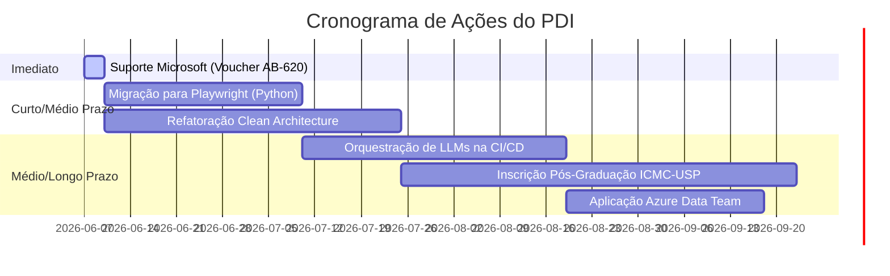

# Roadmap de PDI & Conexão Caipyra 2026

Este documento conecta os objetivos de carreira de curto, médio e longo prazo do Rafael Feltrim com os aprendizados, palestras e conexões obtidos durante o **Caipyra 2026** (realizado no ICMC-USP, São Carlos/SP).

---

## 🎯 1. Objetivos de Carreira (Rafael Feltrim)

### Curto Prazo (Imediato)
* **Resolução do Incidente do Voucher AB-620**:
  * **Objetivo**: Solicitar a reemissão do voucher de 100% de desconto para o exame Beta **AB-620** (*Designing and Building Integrated AI Agent Solutions in Copilot Studio*).
  * **Contexto**: O exame foi cancelado indevidamente pela Pearson VUE em 23 de maio de 2026 devido a movimentos involuntários decorrentes do diagnóstico de TDAH/ADHD do candidato (saindo brevemente do campo de visão da câmera).
  * **Ação**: Postar uma solicitação detalhada e formal (em inglês) no fórum de suporte de credenciais da Microsoft (`trainingsupport.microsoft.com`).
  * **Meta/SLA**: Aguardar retorno e reemissão em até 3 dias úteis após o envio do formulário de suporte.

### Médio Prazo (Próximo Semestre / 6 a 12 meses)
* **Transição de Carreira para Azure Data Quality**:
  * **Objetivo**: Aplicar para a vaga de **Software Quality Engineering no Azure Data Engineering Team** (focado em Microsoft Fabric, Power BI e ecossistema de dados Azure).
  * **Estratégia**: Anexar a credencial aprovada do exame Beta AB-620 e comprovar competência técnica prática em arquiteturas de IA e qualidade de dados na Microsoft.
* **Desenvolvimento Acadêmico no ICMC-USP**:
  * **Objetivo**: Ingressar como **aluno especial** em disciplinas de pós-graduação voltadas para desenvolvimento Web e Mobile no **ICMC-USP** (São Carlos/SP).
  * **Estratégia**: Fortalecer a base acadêmica de engenharia de software e consolidar networking com professores da USP.

### Longo Prazo / Geral
* Consolidar os mais de 4.5 anos de experiência prática como Software Quality Engineer, tornando-se referência em arquiteturas de testes resilientes, orquestração de testes com LLMs locais/nuvem e qualidade de pipelines de engenharia de dados.

---

## 🛠️ 2. Mapeamento de Competências (Roadmap)

### Hard Skills
1. **Qualidade de Dados & Cloud**: Azure Data Services, Microsoft Fabric, Power BI.
2. **Desenvolvimento de IA**: Copilot Studio e integração de modelos cognitivos/agentes.
3. **Automação de Testes**: Playwright (Python).
4. **Engenharia de Software**: Clean Architecture, Clean Code e Princípios SOLID.

### Soft Skills
1. **Acomodação e Autogestão de TDAH/ADHD**: Desenvolvimento de estratégias para ambientes corporativos e exames de certificação remotos/proctorados, mitigando riscos de cancelamento e melhorando o foco.

---

## 📈 3. Plano de Ação do PDI

### Detalhamento dos Itens de Ação:
1. **Resolução do Voucher AB-620**:
   * *Ação*: Postar o caso detalhado e fundamentado clinicamente no fórum `trainingsupport.microsoft.com` em inglês.
   * *Status*: Aguardando reemissão.
2. **Migração para Playwright**:
   * *Ação*: Substituir a suíte de testes legados em Selenium para Playwright para mitigar *flaky tests* e falsos-negativos, focando no [leadflow-crm](file:///c:/Users/Rafael%20Feltrim/Downloads/Caipyra%202026/Planejamento/leadflow-crm_planejamento.md).
3. **Refatoração de Arquitetura**:
   * *Ação*: Refatorar a aplicação [gestao_pedidos](file:///c:/Users/Rafael%20Feltrim/Downloads/Caipyra%202026/Planejamento/gestao_pedidos_planejamento.md) seguindo *Clean Architecture* e SOLID, estabelecendo a fundação conceitual exigida nas disciplinas do ICMC-USP.
4. **Orquestração de IA na CI/CD**:
   * *Ação*: Desenvolver e integrar LLMs locais via Ollama na esteira de testes do repositório [executive-qa-view-boilerplate](file:///c:/Users/Rafael%20Feltrim/Downloads/Caipyra%202026/Planejamento/executive-qa-view-boilerplate_planejamento.md) para triagem inteligente e categorização automática de logs de falhas.

---

## 🌾 4. Alinhamento dos Aprendizados: Caipyra 2026 🤝 Objetivos de PDI

A tabela abaixo conecta as atividades e palestras do Caipyra 2026 com os objetivos estratégicos de carreira do Rafael:

| Palestra / Atividade no Caipyra 2026 | Aprendizados Chave | Conexão com o PDI / Objetivos de Carreira |
| :--- | :--- | :--- |
| **Pytorch é Python Fluente (Deep Learning)** *(Palestrante: Moacir Antonelli Ponti)* | Deep Learning prático com PyTorch, matemática aplicada, Clean Code e uso de arquiteturas como EventEncoder. | 1. **Objetivo ICMC-USP**: O palestrante é professor do ICMC-USP, oferecendo uma prévia direta do nível acadêmico e das linhas de pesquisa. 2. **Orquestração de IA (CI/CD)**: Fornece embasamento conceitual para pipelines inteligentes de triagem de logs. |
| **Airflow no Legado Iceberg: Lakehouses** | Orquestração moderna de Lakehouses baseadas em tabelas Apache Iceberg sob o Apache Airflow. | **Vaga no Azure Data Team**: Domínio de orquestração moderna de dados e Lakehouses é essencial para atuar em Quality Engineering no ecossistema Microsoft Fabric/Azure Data. |
| **dbt e Snowflake: Transformando Dados com SQL** | Modelagem de dados eficiente, testes de qualidade de dados na transformação de dados utilizando dbt. | **Vaga no Azure Data Team**: O Microsoft Fabric possui alta sinergia com conceitos de modelagem e transformação distribuída de dados e pipelines de qualidade de dados (*Data Quality*). |
| **Dask para Processamento Massivo de Dados** | Processamento paralelo escalável com Python para grandes volumes de dados. | **Vaga no Azure Data Team & ICMC-USP**: Fornece base sólida sobre paralelismo e computação distribuída em Python, competência essencial para ambas as metas. |
| **Automação E2E Resiliente com Playwright e Python** *(Tema de conexão do evento)* | Estruturação de testes de ponta a ponta rápidos e robustos, evitando *flaky tests*. | **Migração para Playwright**: Conexão direta com o item de ação para modernizar a automação de testes das ferramentas internas e mitigar falsos-negativos. |
| **Orquestração de LLMs em Pipelines de CI/CD** *(Tema de conexão do evento)* | Uso de Claude, GPT e Gemini integrados nas esteiras de testes automatizadas. | **Orquestração de IA na CI/CD**: Base metodológica e prática para implementar triagem inteligente de logs de testes do repositório `Executive-QA-View`. |
| **APIs e Clean Architecture** *(Tema de conexão do evento)* | Padrões arquiteturais limpos aplicados em serviços web. | **Refatoração de Arquitetura**: Fornece os pilares práticos para a reestruturação do `MKP Manager` e `Agenda QA`, alinhando-se aos pré-requisitos do ICMC-USP. |
| **Ecossistema Téo Me Why: Comunidade** | Visão de comunidade, educação e colaboração em dados/IA. | **Networking**: Expansão de conexões com profissionais de engenharia de dados nacionais, aumentando a rede de apoio profissional. |
| **Encerramento e Q&A** *(Gabu Bellon - Lead Data Engineer na phData)* | Insights de carreira em dados, tendências globais e indicação de materiais recomendados. | **Transição Profissional**: Entendimento do mercado internacional e melhores práticas de Engenharia e Qualidade de Dados. |

---

> [!NOTE]
> Este roadmap deve ser revisado periodicamente (mensalmente ou a cada entrega de milestone) para acompanhar a reemissão do voucher AB-620, o andamento das refatorações e o processo seletivo do ICMC-USP.
